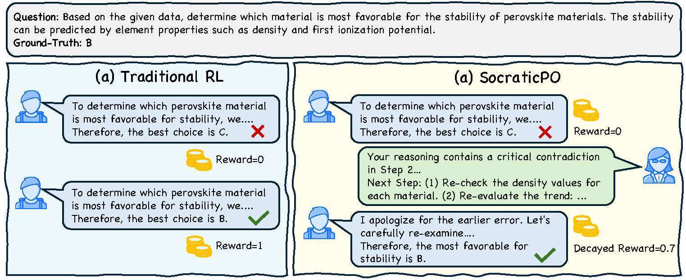
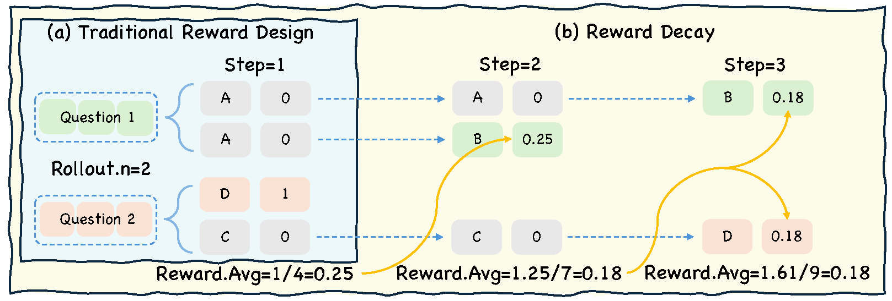
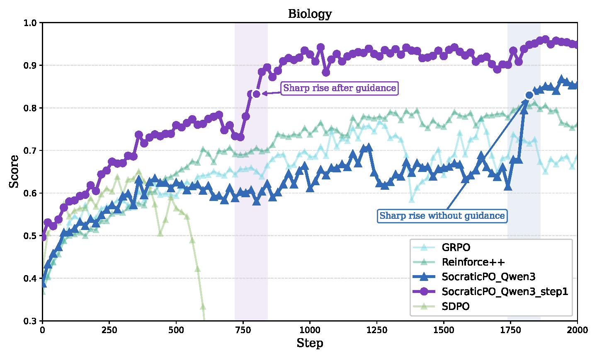
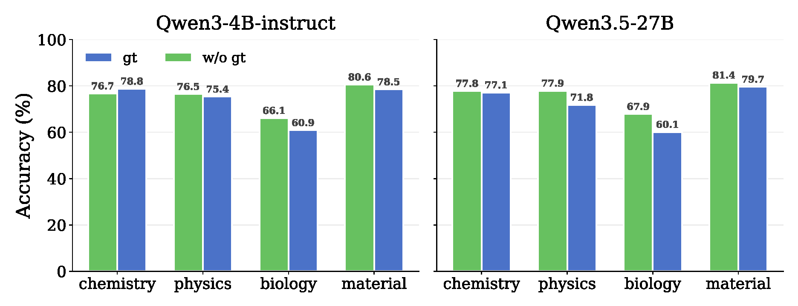
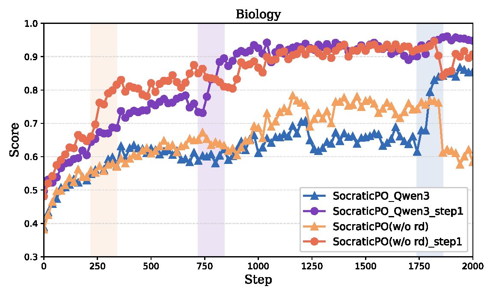
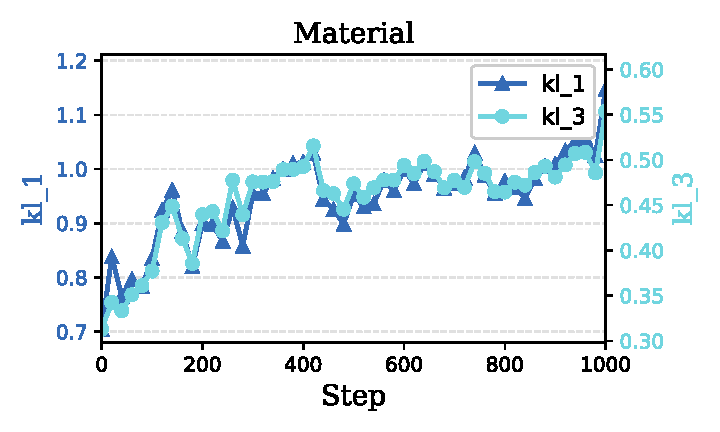

# SocraticPO: Policy Optimization via Interactive Guidance

This repository contains the paper and resources for **SocraticPO**, an interactive policy-optimization framework that augments reinforcement learning for LLM reasoning with teacher-guided corrective feedback.

Traditional RL for LLMs usually relies on scalar rewards, such as binary correctness. These rewards tell the model whether an answer is correct, but not where its reasoning went wrong. SocraticPO introduces a teacher into the rollout process: when the student answers incorrectly, the teacher provides concise natural-language guidance, and the student retries under the expanded context.

To prevent the model from relying on teacher help as a shortcut, SocraticPO further introduces **Reward Decay**, which gives smaller rewards to answers that become correct only after more rounds of guidance.

## Overview



SocraticPO modifies only the rollout process while keeping the standard expected-reward objective, making it compatible with existing policy-gradient backends such as Reinforce++.

## Reward Design



The reward design combines:

- **Step-wise rewards**, which assign credit to the specific student attempt that becomes correct.
- **Reward Decay**, which calibrates credit across the batch by assigning smaller rewards to later guided successes.

## Training Dynamics



We observe a two-stage pattern: the student first improves its ability to answer correctly after guidance, and later internalizes these corrections into stronger unassisted performance as reward decay shifts credit toward earlier independent correctness.

## Experiments

We evaluate SocraticPO on undergraduate-level scientific reasoning benchmarks from SciKnowEval, covering:

- Chemistry
- Physics
- Biology
- Material Science

SocraticPO improves over strong RL and self-distillation baselines, and ablations show that both teacher guidance and reward decay are important.

## Additional Analyses



We analyze whether teachers should access ground-truth answers or reference solutions. Such access can help when the teacher follows the teaching protocol well, but may hurt when it leaks answer-specific hints.



Ablation results show that removing reward decay significantly hurts performance, especially with stronger teachers.



Teacher-student KL analysis suggests that SocraticPO does not simply make the student imitate the teacher. Instead, the teacher acts as an interactive guide for reasoning correction.

## Environment Preparation and Training

SocraticPO is developed based on `verl`; configuring `verl` is sufficient to run the project. Please configure the runtime according to the official [`verl` installation guide](https://verl.readthedocs.io/en/latest/start/install.html). The current setup is based on `verl==0.7.0`.

After setting up `verl`, replace the original `reward_score` directory in the `verl` source tree with the `reward_score` directory provided in this repository, so that the modified SocraticPO reward logic is used during training.

Configure the working directory, conda environment, CUDA module, model path, dataset path, teacher endpoint, and related training parameters in [`job-qwen3-4b-tg-main.sh`](job-qwen3-4b-tg-main.sh).

Launch training with:

```bash
bash job-qwen3-4b-tg-main.sh
```

## Citation

Coming soon.
